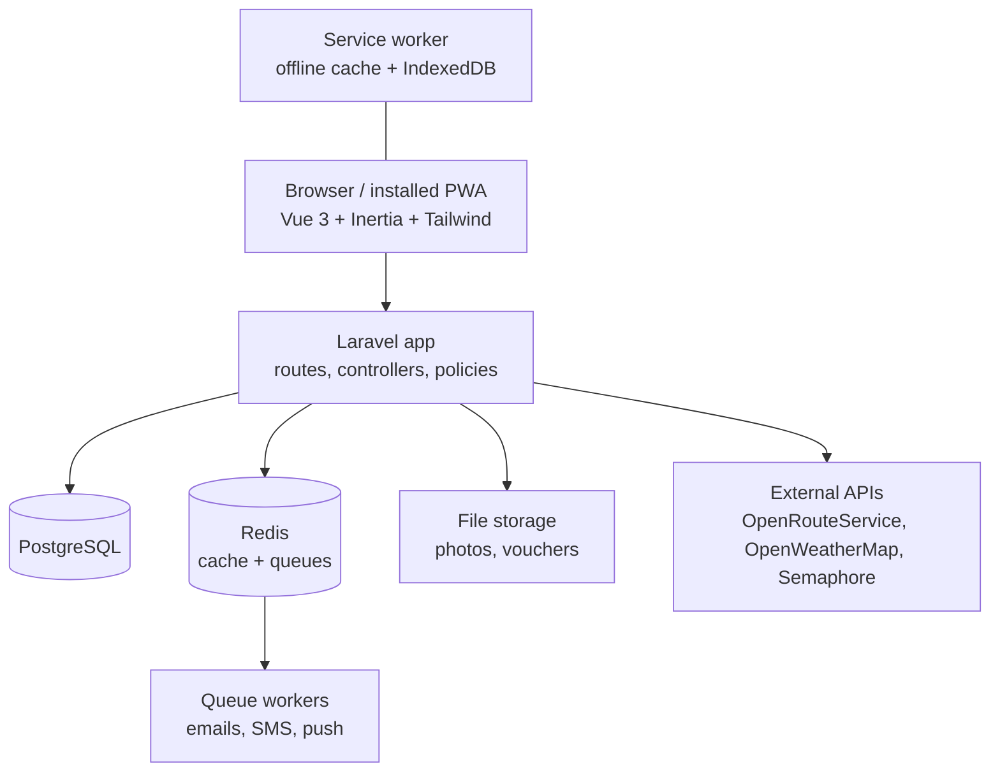
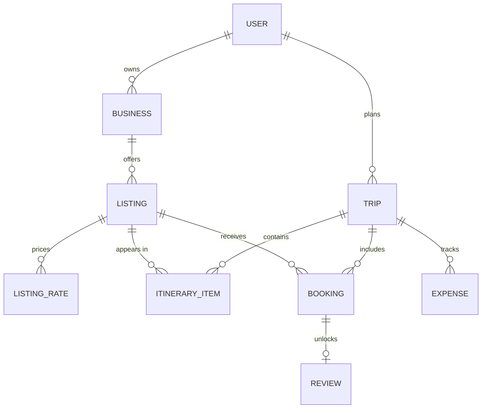
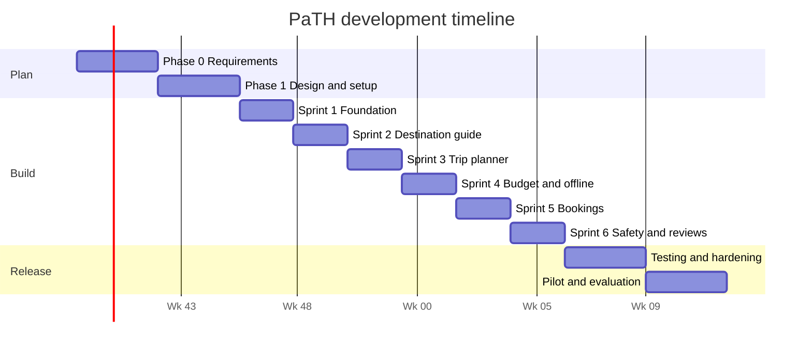

# PaTH: Paoay Travel Hub — Development Gameplan

This is the build plan for PaTH. It covers the tech stack, architecture, database, and a 24-week plan split into sprints with task checklists. For the project's goals and features, see [PaTH-Project-Write-Up.md](PaTH-Project-Write-Up.md).

**Platform:** a responsive web app, installable as a Progressive Web App (PWA). There is no native mobile app. Tourists use it in their phone's browser, and partners and staff mostly use it on desktop.

---

## 1. Technology stack

| Layer | Choice | Why |
| --- | --- | --- |
| Backend framework | Laravel (latest stable, PHP 8.3+) | Built-in auth, queues, notifications, scheduler, validation |
| Frontend framework | Vue 3 (Composition API, `<script setup>`, TypeScript) | Component-based UI |
| Laravel–Vue bridge | Inertia.js | Single-page app feel without building a separate API |
| Styling | Tailwind CSS | Utility-first, mobile-first layouts |
| UI components | Laravel Vue starter kit (shadcn-vue) | Accessible base components out of the box |
| Build tool | Vite | Ships with Laravel |
| Database | PostgreSQL (MySQL 8 also works) | Relational data, JSON columns, good geo support |
| Cache, queues, sessions | Redis (database driver for local development) | Background jobs and notifications |
| Auth | Laravel starter kit auth (Fortify) + Socialite for Google login | Email verification, password reset, 2FA |
| Roles and permissions | `spatie/laravel-permission` | Tourist, partner, tourism officer, admin |
| Images | `spatie/laravel-medialibrary` + `intervention/image` | Uploads, resizing, thumbnails |
| Maps | Leaflet + OpenStreetMap tiles (`@vue-leaflet/vue-leaflet`) | Free, no billing account needed |
| Routing and travel time | OpenRouteService API (or self-hosted OSRM) | Directions and distance estimates |
| Weather | OpenWeatherMap API | Forecasts and weather alerts |
| QR codes | `simplesoftwareio/simple-qrcode` (create) + `html5-qrcode` (scan in browser) | Booking vouchers |
| Offline / PWA | `vite-plugin-pwa` (Workbox) + IndexedDB via `localforage` | Saved trips work without signal |
| Email | Laravel Mail (Mailtrap for development, Brevo or Amazon SES for production) | Booking and account emails |
| SMS | Semaphore (PH SMS gateway) | OTP and SOS messages |
| Push notifications | Web Push (`laravel-notification-channels/webpush`) | Reminders and advisories |
| Charts | ApexCharts (`vue3-apexcharts`) | Dashboards and analytics |
| Drag and drop | `vuedraggable` (SortableJS) | Itinerary reordering |
| Testing | Pest (backend), Vitest (frontend), Playwright (end-to-end) | |
| Code quality | Laravel Pint, Larastan, ESLint, Prettier | |
| Hosting | VPS (DigitalOcean, Hostinger or AWS Lightsail) with Laravel Forge or Ploi | HTTPS, queues, scheduled jobs |
| Version control and CI | Git + GitHub + GitHub Actions | Tests on every pull request |

---

## 2. Architecture



### How the app is layered

- **Controllers** stay thin. They validate with Form Requests, call a service or action, and return an Inertia page.
- **Actions/Services** (`app/Actions`, `app/Services`) hold the business logic, such as `CreateBookingAction` or `ItineraryPlanner`.
- **Policies** decide who can view or change each record.
- **Events and listeners** trigger side effects. For example, `BookingConfirmed` sends an email and a push notification.
- **Jobs** run slow work on the queue: notifications, image processing, weather syncing.
- **A small JSON API** (`routes/api.php`, Sanctum) is used only where Inertia is a poor fit: offline sync, map data, autocomplete.

### Offline strategy (replaces the mobile app's offline mode)

1. The service worker caches the app shell (JS, CSS, icons, fonts).
2. When a tourist taps **Make available offline** on a trip, the app saves the itinerary, booking vouchers (with QR codes), emergency hotlines and listing details to IndexedDB.
3. Map tiles for the Paoay area are cached for the zoom levels the itinerary needs.
4. Changes made offline (expenses, notes, ticking off stops) go into an outbox queue in IndexedDB.
5. When the device reconnects, the outbox posts to `/api/sync`. The server applies the changes in order and resolves conflicts by last-write-wins, using timestamps.

---

## 3. Project structure

```text
path/
├── app/
│   ├── Actions/            # single-purpose business actions
│   ├── Enums/              # BookingStatus, ListingCategory, ExpenseCategory, Role
│   ├── Events/  Listeners/
│   ├── Http/
│   │   ├── Controllers/
│   │   │   ├── Tourist/    # trips, bookings, expenses, reviews
│   │   │   ├── Partner/    # listings, availability, bookings
│   │   │   ├── Office/     # advisories, events, verification, analytics
│   │   │   └── Admin/      # users, moderation, settings
│   │   ├── Middleware/
│   │   └── Requests/
│   ├── Jobs/
│   ├── Models/
│   ├── Notifications/
│   ├── Policies/
│   └── Services/           # ItineraryPlanner, RoutingService, WeatherService, SmsService
├── database/
│   ├── factories/  migrations/  seeders/
├── resources/
│   ├── css/app.css
│   └── js/
│       ├── components/     # shared UI (cards, map, forms)
│       ├── composables/    # useOffline, useGeolocation, useBudget
│       ├── layouts/        # PublicLayout, TouristLayout, PartnerLayout, OfficeLayout, AdminLayout
│       ├── pages/          # Inertia pages, grouped by role
│       ├── offline/        # IndexedDB store, sync outbox
│       └── types/
├── routes/
│   ├── web.php  api.php  console.php
└── tests/
    ├── Feature/  Unit/
    └── e2e/                # Playwright
```

---

## 4. Database design

### Tables

| Table | Key columns |
| --- | --- |
| `users` | name, email, phone, password, avatar, locale, email_verified_at |
| `roles`, `permissions` (spatie) | tourist, partner, tourism_officer, admin |
| `tourist_profiles` | user_id, interests (json), group_size, budget_min, budget_max, accessibility_needs (json) |
| `emergency_contacts` | user_id, name, relationship, phone |
| `businesses` | owner_id, name, type, permit_no, contact, verification_status, verified_by, verified_at |
| `categories` | name, slug, icon (attraction, food, lodging, shop, activity, transport, service) |
| `listings` | business_id (nullable for public sites), category_id, name, slug, description, address, latitude, longitude, opening_hours (json), entrance_fee, price_min, price_max, is_bookable, is_accessible, status |
| `listing_rates` | listing_id, name (e.g. "4x4 ride, 5 pax"), price, unit, capacity |
| `availability_blocks` | listing_id, date, slots_total, slots_booked, is_closed |
| `heritage_stories` | listing_id, title, body |
| `events` | title, description, venue_listing_id, starts_at, ends_at, is_featured |
| `trips` | user_id, title, start_date, end_date, budget, pax, share_token, status |
| `trip_members` | trip_id, user_id, role (owner, editor, viewer) |
| `itinerary_items` | trip_id, listing_id (nullable), custom_title, day_number, start_time, end_time, position, notes, is_done, travel_minutes_from_previous |
| `itinerary_templates` + `template_items` | ready-made plans such as "Paoay in One Day" |
| `bookings` | code, user_id, trip_id, listing_id, listing_rate_id, date, time, pax, total_amount, status, partner_note, qr_token, confirmed_at, checked_in_at, cancelled_at |
| `expenses` | trip_id, user_id, category, amount, spent_on, note, paid_by, client_uuid |
| `expense_splits` | expense_id, user_id, share_amount |
| `reviews` | user_id, listing_id, booking_id, rating, comment, partner_reply, status |
| `advisories` | author_id, title, body, severity, affected_listing_ids (json), starts_at, ends_at |
| `sos_alerts` | user_id, latitude, longitude, message, status, resolved_at |
| `hotlines` | name, type, phone |
| `site_visits` | listing_id, user_id, visited_on (feeds analytics) |
| `notifications`, `push_subscriptions`, `jobs`, `media`, `activity_log` | Laravel and package tables |

### Main relationships



### Booking status rules

| From | To | Who | Trigger |
| --- | --- | --- | --- |
| — | Pending | Tourist | Submits a booking request |
| Pending | Confirmed | Partner | Accepts; QR voucher is created |
| Pending | Declined | Partner | Declines with a reason |
| Pending | Cancelled | Tourist | Withdraws the request |
| Pending | Expired | System | No reply within 48 hours |
| Confirmed | Cancelled | Tourist or partner | Cancels before the booking date |
| Confirmed | Completed | Partner | Scans the QR code on arrival |
| Confirmed | No-show | System | Not checked in by the end of the booking date |

Only **Completed** bookings let a tourist post a review of that listing.

---

## 5. Roles, pages and routes

| Role | Route prefix | Main pages |
| --- | --- | --- |
| Guest | `/` | Home, explore listings, listing detail, events, map, login, register |
| Tourist | `/my` | Dashboard, trips, trip planner, bookings, budget, reviews, profile, SOS |
| Partner | `/partner` | Dashboard, business profile, listings, rates and availability, bookings, QR scanner, reviews, reports |
| Tourism officer | `/office` | Dashboard, partner verification, attractions, events, advisories, SOS monitor, analytics |
| Admin | `/admin` | Users and roles, categories, hotlines, content moderation, settings, activity log |

Access is enforced three ways: route middleware (`role:partner`), policies on each model, and hidden menu items in the Vue layouts.

---

## 6. Development timeline

The plan runs **24 weeks** using Scrum with two-week sprints. Each sprint ends with a demo and a short retrospective.



The dates assume a start on October 5, 2026. Shift them to your actual start date.

---

### Phase 0 — Requirements (weeks 1–3)

- [ ] Interview the Paoay Municipal Tourism Office about their needs, data and advisories
- [ ] Interview 5–10 business partners (resort, restaurant, 4x4 operator, tricycle driver, souvenir shop)
- [ ] Survey tourists about how they plan trips and what goes wrong
- [ ] Review similar apps and sites (travel booking sites, local tourism pages)
- [ ] List every attraction, food place and lodging to seed the database
- [ ] Write user stories for each role and rank them (must / should / could)
- [ ] Get consent letters and data-sharing agreements for the pilot

**Deliverable:** signed-off requirements and a ranked product backlog.

### Phase 1 — Design and setup (weeks 4–6)

**Design**

- [ ] Sitemap and user flows for each role
- [ ] Low-fidelity wireframes, mobile-first for tourist pages
- [ ] High-fidelity mockups in Figma with a design system: colors, type, spacing, components
- [ ] Final ERD and migration plan
- [ ] Clickable prototype tested with 3–5 tourists

**Environment setup**

- [ ] Create a GitHub repo, branch rules (`main`, `develop`, `feature/*`) and a PR template
- [ ] `laravel new path` using the **Vue starter kit** (Inertia + Vue + TypeScript + Tailwind)
- [ ] Set up local development with Laravel Herd or Laravel Sail (Docker)
- [ ] Configure PostgreSQL, Redis, Mailtrap and `.env.example`
- [ ] Install Pint, Larastan, ESLint, Prettier, Pest, Vitest, Playwright
- [ ] GitHub Actions workflow: lint, static analysis, tests on every PR
- [ ] Staging server with automatic deploy from `develop`

**Deliverable:** approved designs, a running empty app on staging, CI passing.

### Sprint 1 — Foundation (weeks 7–8)

- [ ] Registration, login, logout, email verification, password reset
- [ ] Google login with Socialite
- [ ] Phone OTP verification with Semaphore
- [ ] Install `spatie/laravel-permission`; seed roles and permissions
- [ ] Role-based redirects and middleware after login
- [ ] Layouts for public, tourist, partner, office and admin areas
- [ ] Tourist profile: preferences, accessibility needs, emergency contacts
- [ ] Partner sign-up that creates a business awaiting verification
- [ ] Admin: user list, search, change role, deactivate account
- [ ] Activity log for sensitive actions
- [ ] Language switcher (English and Filipino) using `laravel-vue-i18n`

**Done when:** each role can sign up or be created, log in, and see only its own area.

### Sprint 2 — Destination guide and maps (weeks 9–10)

- [ ] Migrations, models, factories and seeders for categories, listings, rates, heritage stories, events and hotlines
- [ ] Seed real Paoay data: Paoay Church, Paoay Lake, Malacañang of the North, Paoay Sand Dunes, and gathered restaurants and lodging
- [ ] Photo uploads with media library (resized thumbnails, WebP)
- [ ] Explore page with filters: category, price, rating, distance, accessibility
- [ ] Search with Laravel Scout (database driver)
- [ ] Listing detail page: gallery, hours, fees, rates, map pin, heritage story, reviews
- [ ] Map page with Leaflet: all listings, category filters, marker clusters, "near me"
- [ ] Events calendar page
- [ ] Office: create and edit attractions, events and heritage stories
- [ ] Office: approve or reject partner businesses
- [ ] Partner: create and edit own listings, rates and photos (saved as draft until approved)
- [ ] SEO: page titles, meta tags, Open Graph images, sitemap.xml

**Done when:** a guest can browse, filter and map every Paoay listing on a phone.

### Sprint 3 — Smart trip planner (weeks 11–12)

- [ ] Create a trip: title, dates, number of people, budget
- [ ] Add listings to a trip from the explore, detail or map pages
- [ ] Day-by-day itinerary view with drag-and-drop reordering (`vuedraggable`)
- [ ] `RoutingService`: travel time between stops with OpenRouteService, cached in Redis
- [ ] `ItineraryPlanner`: auto-arrange stops by distance, opening hours and interests
- [ ] Warnings: site closed that day, too many stops, not enough travel time
- [ ] Notes per stop and custom stops (e.g. "Lunch at home")
- [ ] Ready-made templates: "Paoay in One Day", "Heritage and Dunes Weekend"
- [ ] Share a trip by link or invite companions as editors or viewers
- [ ] Itinerary shown on the map as a route
- [ ] Print-friendly and downloadable PDF itinerary (`barryvdh/laravel-dompdf`)

**Done when:** a tourist can build, auto-arrange, edit and share a multi-day plan.

### Sprint 4 — Budget tracker and offline mode (weeks 13–14)

**Budget**

- [ ] Estimated cost from itinerary fees and bookings
- [ ] Log expenses by category: lodging, food, transport, activities, pasalubong, others
- [ ] Budget progress bar and category breakdown chart
- [ ] Alerts at 80% and 100% of budget
- [ ] Group cost split: who paid, who owes whom

**Offline (PWA)**

- [ ] Configure `vite-plugin-pwa`: manifest, icons, install prompt
- [ ] Cache the app shell and key pages
- [ ] "Make available offline" button that saves the trip, vouchers and hotlines to IndexedDB
- [ ] Cache Paoay map tiles for the trip area
- [ ] Offline banner and read-only offline trip view
- [ ] Outbox for offline expenses, notes and ticked stops
- [ ] `/api/sync` endpoint with `client_uuid` to avoid duplicates
- [ ] Test on slow 3G and airplane mode in Chrome DevTools and on real phones

**Done when:** a tourist can open their saved trip and log expenses with no signal, and the changes sync later.

### Sprint 5 — Bookings (weeks 15–16)

- [ ] Partner: set availability per date (slots, closed days)
- [ ] Tourist: booking request form with date, time, pax and rate; shows total price
- [ ] Prevent overbooking with database transactions and row locks
- [ ] `BookingStatus` enum and state transitions (see section 4)
- [ ] Partner booking inbox: accept, decline with reason, cancel
- [ ] Voucher page with booking code and QR code; downloadable PDF
- [ ] Partner QR scanner page (`html5-qrcode`) that marks a booking completed
- [ ] Scheduled jobs: expire pending bookings after 48 hours; mark no-shows
- [ ] Notifications by email, in-app and web push for every status change
- [ ] Payment instructions shown on confirmation (on-site, or partner's GCash/bank details)
- [ ] Partner reports: bookings per month, earnings, top-selling rates
- [ ] Confirmed bookings appear on the tourist's itinerary automatically

**Done when:** a tourist can book a 4x4 ride, the partner confirms it, and scanning the QR code completes it.

### Sprint 6 — Alerts, safety, reviews and analytics (weeks 17–18)

- [ ] `WeatherService`: daily forecast for Paoay from OpenWeatherMap, cached hourly
- [ ] Weather shown on trip days; rain or typhoon warning banners
- [ ] Office: post advisories (closures, crowd warnings) with severity and affected sites
- [ ] Advisories shown on affected listings and itineraries, and pushed to tourists with trips on those dates
- [ ] Reminders: evening before the trip and 1 hour before each booking (scheduler)
- [ ] SOS button: gets location, sends SMS and email to emergency contacts, logs an `sos_alert`
- [ ] Office SOS monitor with live list and map (polling every 15 seconds)
- [ ] Hotlines page that works offline
- [ ] Reviews: only after a completed booking or checked-in visit; star rating and comment
- [ ] Partner replies to reviews; office and admin moderation queue
- [ ] Trip recap page: places visited, photos, total spending
- [ ] Office analytics dashboard: tourists per day, top sites, peak dates, visitor origin, booking volume (ApexCharts), CSV export

**Done when:** all ten modules from the write-up work end to end on staging.

### Testing and hardening (weeks 19–21)

- [ ] Feature tests for every role's main flows (target 80% backend coverage)
- [ ] Unit tests for `ItineraryPlanner`, booking transitions, budget splits, sync
- [ ] Playwright end-to-end tests: sign up → plan trip → book → check in → review
- [ ] Security checks: policies on every route, rate limiting on login/OTP/SOS, CSRF, file upload validation, OWASP Top 10 review
- [ ] Data Privacy Act (RA 10173) review: privacy notice, consent checkboxes, account deletion, data export
- [ ] Performance: eager loading (no N+1 queries), database indexes, Redis caching, image lazy loading; Lighthouse score 90+ on mobile
- [ ] Accessibility: keyboard navigation, labels, color contrast (WCAG 2.1 AA)
- [ ] Cross-browser testing: Chrome, Safari (iOS), Firefox, Edge, Samsung Internet
- [ ] User acceptance testing with tourists, partners and tourism office staff
- [ ] Fix all critical and high-priority bugs

**Deliverable:** release candidate that passes UAT.

### Pilot and evaluation (weeks 22–24)

- [ ] Production server: HTTPS, queue workers (Supervisor or Horizon), scheduler cron, daily database backups
- [ ] Error tracking (Sentry or Flare) and uptime monitoring
- [ ] Onboard pilot partners and train tourism office staff
- [ ] Short user guides for each role (PDF or in-app help)
- [ ] Run the pilot in Paoay for at least 2 weeks
- [ ] Collect ISO/IEC 25010 evaluation forms from tourists, partners, staff and IT experts
- [ ] Compute weighted means and interpret results
- [ ] Fix issues found during the pilot
- [ ] Final documentation and presentation

**Deliverable:** live system, evaluation results, final report.

---

## 7. Team roles (suggested)

| Role | Responsibilities |
| --- | --- |
| Project manager / Scrum master | Backlog, sprint planning, stakeholder contact, documentation |
| Backend developer (Laravel) | Database, business logic, APIs, jobs, integrations |
| Frontend developer (Vue + Tailwind) | Pages, components, maps, PWA and offline |
| UI/UX designer | Wireframes, mockups, usability testing |
| QA tester | Test cases, automated tests, UAT coordination |

A smaller team can combine roles, for example one full-stack developer covering backend and frontend.

---

## 8. Working agreements

- **Branches:** `feature/<short-name>` off `develop`; merge through pull requests with at least one review.
- **Commits:** Conventional Commits, e.g. `feat(bookings): add QR check-in`.
- **Definition of done:** code reviewed, tests written and passing, works on a phone-sized screen, no lint errors, deployed to staging.
- **Code style:** Pint for PHP, ESLint + Prettier for Vue/TS; Vue components use `<script setup lang="ts">`.
- **Secrets:** API keys only in `.env`, never committed.
- **Environments:** local → staging (`develop`) → production (`main`).

---

## 9. Risks and mitigations

| Risk | Impact | Mitigation |
| --- | --- | --- |
| Partners slow to sign up or update listings | Thin or outdated data | Tourism office seeds listings; simple partner onboarding; reminders to update |
| Weak signal at the dunes and lake | App unusable on site | Offline mode built in Sprint 4 and tested on location |
| iOS Safari PWA limits (storage, push) | Offline or push fails on iPhones | Test early on real iPhones; email/SMS fallback for key alerts |
| Free API limits (routing, weather, SMS) | Features stop working | Cache responses in Redis; monitor usage; budget for paid tiers |
| Overbooking during Holy Week peaks | Angry tourists and partners | Transactions and row locks; slot limits per date |
| Scope creep | Missed deadlines | Ranked backlog; "could have" items wait for a later release |
| Privacy of location and personal data | Legal and trust issues | Consent prompts, minimal data kept, RA 10173 review |

---

## 10. After launch (backlog for later releases)

- Online payments (GCash, Maya) through PayMongo
- Ilocano language
- AI-assisted itinerary suggestions
- Loyalty or digital stamp passport for visiting heritage sites
- Expansion to nearby towns (Laoag, Batac, Pagudpud)
