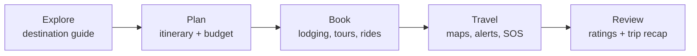
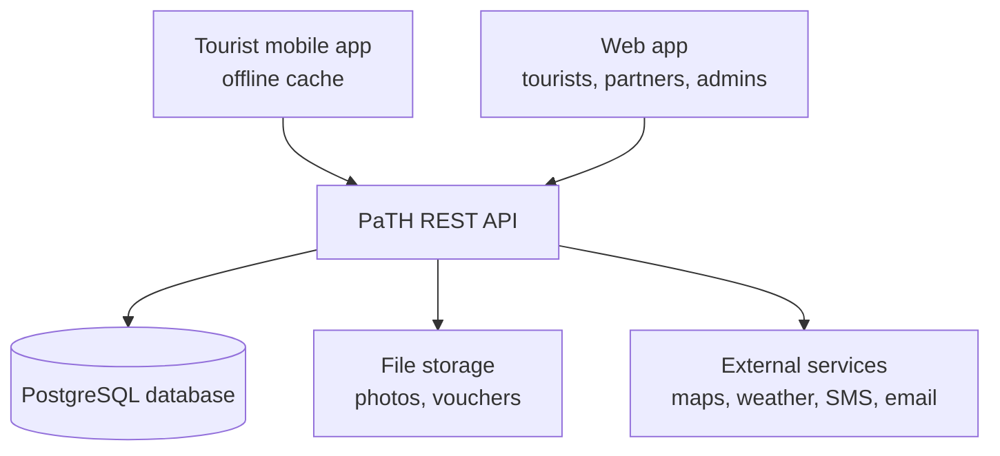
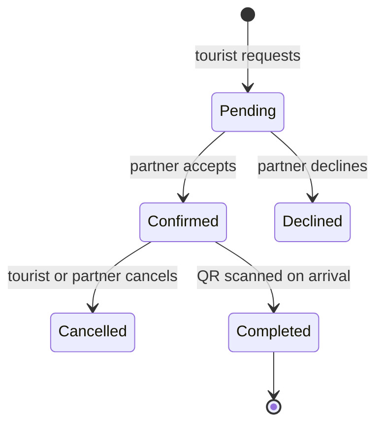

# PaTH: Paoay Travel Hub — Project Write-Up

September 17, 2026

## Project overview

PaTH (Paoay Travel Hub) is a web and mobile system that lets tourists plan, book, manage and complete their trips to Paoay, Ilocos Norte, from one place. It pairs a personal trip planner with local information, bookings, navigation and safety tools, so visitors spend less time sorting out logistics and more time enjoying the town.

The name spells out its purpose. **Pa** stands for Paoay, the destination. **T** stands for Travel, the activity it supports. **H** stands for Hub, one central point for every service a visitor needs. Read as a word, PaTH also describes what the system gives a tourist: a clear path through their trip.

## Background of the study

Paoay is one of the top tourist destinations in Ilocos Norte, but visitors still plan their trips with scattered, informal sources. The town is home to San Agustin Church (Paoay Church), part of the UNESCO World Heritage Site "Baroque Churches of the Philippines." It is also home to Paoay Lake, the Malacañang of the North, and the Paoay Sand Dunes, known for 4x4 rides and sandboarding.

Tourism brings income to the town's resorts, restaurants, tour operators, drivers and souvenir sellers. It also brings pressure: crowds during Holy Week and holidays, traffic near the church, and small businesses that are hard to find online.

Today a tourist usually pieces a trip together from social media posts, travel blogs, messaging apps and word of mouth. Rates, opening hours and schedules are often outdated or missing. Many small operators take bookings by chat or phone, with no record or confirmation. Mobile signal can be weak around the dunes and the lake, so online-only tools can fail when visitors need them most.

PaTH was made to close these gaps. It gathers verified destination information, trip planning, bookings, budgeting and on-trip support in one system that also works offline.

## Statement of the problem

Tourists visiting Paoay have no single, reliable tool for planning and managing their trip. The study addresses these specific problems:

1. How can tourists find accurate, up-to-date information on Paoay's attractions, food places, lodging and events?
2. How can tourists build a realistic itinerary that fits their dates, budget and travel time between sites?
3. How can tourists book and confirm accommodation, tours and transport without relying on chat messages and phone calls?
4. How can tourists track trip expenses and avoid overspending?
5. How can tourists find their way and stay safe, even where mobile signal is weak?
6. How can local businesses and the municipal tourism office reach tourists and understand visitor demand?
7. How acceptable is the resulting system to its users in terms of functionality, usability, reliability and performance?

## Objectives

### General objective

To design, build and evaluate PaTH (Paoay Travel Hub), a system that lets tourists plan, manage and complete their trips to Paoay smoothly, while helping local businesses and the tourism office serve them.

### Specific objectives

1. Build a destination guide listing Paoay's attractions, food places, lodging, events and services, with photos, rates, hours and map locations.
2. Build a trip planner that creates day-by-day itineraries from the tourist's dates, interests and budget, with travel-time estimates between stops.
3. Build a booking module for lodging, tours, activities (such as 4x4 dune rides) and transport, with digital confirmations.
4. Build a budget and expense tracker for each trip.
5. Provide navigation, offline access, weather alerts and emergency help for tourists on the ground.
6. Provide partner and admin dashboards to manage listings, bookings, announcements and visitor analytics.
7. Evaluate the system using the ISO/IEC 25010 software quality model.

## Scope and limitations

### Scope

- Covers destinations, businesses and services inside the Municipality of Paoay, Ilocos Norte.
- Serves four user types: tourists, business partners, the Municipal Tourism Office and system administrators.
- Runs as a responsive web app and an Android/iOS mobile app.
- Includes the destination guide, trip planner, bookings, budget tracker, maps, offline mode, alerts, emergency help, reviews and dashboards.
- Supports English and Filipino, with Ilocano as a later addition.

### Limitations

- PaTH does not process real payments in its first release. Bookings are confirmed by the partner, and payment is made on site or through the partner's own GCash or bank details.
- Listing accuracy depends on partners and the tourism office keeping their information current.
- Offline mode covers saved itineraries, maps and contacts, but not new bookings or live updates.
- Travel to and from Paoay (flights to Laoag, long-distance buses) is shown as information only and cannot be booked.
- Travel times and weather data come from third-party services and may be approximate.

## Significance of the project

| Stakeholder | How PaTH helps |
| --- | --- |
| Tourists | Plan and manage the whole trip in one app, with accurate information, confirmed bookings, a budget and help on hand. |
| Local businesses | Gain an online presence, receive organized bookings and reach more visitors, especially small operators. |
| Municipal Tourism Office | Publish advisories and events, spread visitors across sites, and use visitor data for planning. |
| Local community | Gains more tourism income, fairer exposure for small sellers and less congestion at peak sites. |
| Future researchers | Can use PaTH as a model for smart-tourism systems in other heritage towns. |

## Users and roles

PaTH has four roles, each with its own view of the system.

| Role | Who | Main tasks |
| --- | --- | --- |
| Tourist | Local and foreign visitors | Browse, plan trips, book, track spending, navigate, review, request help |
| Business partner | Resorts, restaurants, tour and 4x4 operators, tricycle and van drivers, souvenir shops | Manage listings, rates and availability; accept or decline bookings; answer reviews |
| Tourism officer | Paoay Municipal Tourism Office staff | Verify partners, manage attractions and events, post advisories, view visitor reports |
| Administrator | System maintainers | Manage accounts and roles, moderate content, back up data, monitor the system |

## System features and modules

PaTH is organized into ten modules that follow a tourist from planning to going home.

Each stage of the trip maps to one or more of the modules below.

### 1. Account and profile

- Sign up with email, phone (OTP) or Google.
- Save travel preferences: interests, group size, budget range, accessibility needs.
- Store emergency contacts for the SOS feature.

### 2. Destination guide

- Listings for attractions, food places, lodging, shops and services, each with photos, description, hours, entrance fees, contact details and map pin.
- Filters by category, price, rating, distance and accessibility.
- Heritage stories for sites such as Paoay Church and the Malacañang of the North.
- Events calendar for festivals, feast days and local activities.

### 3. Smart trip planner

- Creates a day-by-day itinerary from travel dates, interests and budget.
- Orders stops to cut travel time and warns when a plan is too tight or a site is closed.
- Drag-and-drop editing, notes per stop, and sharing with travel companions.
- Ready-made templates, such as "Paoay in One Day" and "Heritage and Dunes Weekend."

### 4. Booking and reservations

- Request bookings for lodging, guided tours, 4x4 dune rides, sandboarding and local transport.
- Real-time availability and rates set by partners.
- Booking status (pending, confirmed, declined, completed, cancelled) with notifications.
- Digital booking voucher with a QR code that partners scan on arrival.

### 5. Budget and expense tracker

- Estimated trip cost built from the itinerary and bookings.
- Log actual spending by category: lodging, food, transport, activities, pasalubong.
- Alerts when spending nears the set budget, plus a cost split for group trips.

### 6. Maps and navigation

- Interactive map of all listings and the tourist's itinerary.
- Directions and travel-time estimates by car, tricycle or on foot.
- Transport guide with typical fares and terminal locations.

### 7. Offline mode

- Download the itinerary, vouchers, map area and emergency contacts before the trip.
- Changes made offline sync once the device reconnects.

### 8. Alerts and safety

- Weather updates and advisories from the tourism office, such as closures or crowd warnings.
- Reminders for upcoming stops and bookings.
- SOS button that shares the tourist's location with saved contacts and shows hotlines for police, rescue, hospitals and the tourism office.

### 9. Reviews and community

- Ratings and reviews that only tourists with completed bookings or visits can post.
- Trip recap with photos, visited places and total spending.

### 10. Partner and admin dashboards

- Partners manage listings, availability, rates and bookings, and see simple sales reports.
- The tourism office verifies partners, publishes advisories and events, and views analytics: visitor counts, popular sites, peak dates and visitor origin.
- Administrators manage users, roles, content moderation and backups.

## System architecture

PaTH uses a client–server design: web and mobile apps talk to one REST API backed by a single database.

The mobile app keeps a local copy of trip data, so saved plans work without signal.

### Proposed technology stack

| Layer | Technology |
| --- | --- |
| Mobile app | Flutter (Android and iOS) with SQLite for offline storage |
| Web app | React with Tailwind CSS |
| Backend API | Node.js with Express, or Laravel |
| Database | PostgreSQL |
| Maps and routing | OpenStreetMap with Leaflet or Mapbox |
| Weather | OpenWeatherMap API |
| Notifications | Firebase Cloud Messaging, SMS gateway, email |
| Hosting | Cloud VPS with daily backups |

### Core data entities

| Entity | Key fields |
| --- | --- |
| User | name, email, phone, role, preferences, emergency contacts |
| Listing | partner, category, name, description, rates, hours, location, photos, status |
| Trip | tourist, title, start and end dates, budget, companions |
| ItineraryItem | trip, listing, day, start time, notes, order |
| Booking | tourist, listing, dates, guests, amount, status, QR code |
| Expense | trip, category, amount, date, note |
| Review | tourist, listing, rating, comment, date |
| Advisory | author, title, message, affected sites, valid dates |
| Event | name, venue, dates, description |

### Booking flow

Only completed bookings unlock reviews, which keeps ratings honest.

## Non-functional requirements

| Quality | Requirement |
| --- | --- |
| Performance | Pages and screens load in under 3 seconds on a 4G connection. |
| Availability | 99% uptime, with extra capacity planned for Holy Week and holiday peaks. |
| Offline use | Saved trips, vouchers, maps and hotlines open with no connection. |
| Security | Encrypted connections (HTTPS), hashed passwords, role-based access. |
| Privacy | Complies with the Data Privacy Act of 2012 (RA 10173); location is shared only when the tourist allows it. |
| Usability | A first-time user can build an itinerary in under 10 minutes without help. |
| Accessibility | Readable text sizes, good color contrast, and screen-reader labels. |
| Compatibility | Android 8+, iOS 14+, and current Chrome, Safari, Firefox and Edge. |
| Maintainability | Modular code, API documentation, and automated backups. |

## Development methodology

PaTH is built with the Agile Scrum method in two-week sprints, so tourists, partners and the tourism office can test each release and shape the next one.

| Phase | Activities | Duration |
| --- | --- | --- |
| 1. Requirements gathering | Interviews with the tourism office and partners; surveys of tourists; review of similar apps | 3 weeks |
| 2. System design | Architecture, database design, wireframes and prototypes | 3 weeks |
| 3. Development (Sprints 1–2) | Accounts, destination guide, maps | 4 weeks |
| 4. Development (Sprints 3–4) | Trip planner, budget tracker, offline mode | 4 weeks |
| 5. Development (Sprints 5–6) | Bookings, alerts and SOS, reviews, dashboards | 4 weeks |
| 6. Testing | Unit, integration and user acceptance testing | 3 weeks |
| 7. Deployment and evaluation | Pilot run in Paoay, user evaluation, fixes | 3 weeks |

The full plan runs about 24 weeks, or six months.

## Evaluation

PaTH will be evaluated against the ISO/IEC 25010 software quality model. Respondents will be tourists, business partners, tourism office staff and IT experts. They will rate the system on a 5-point Likert scale across these criteria:

- Functional suitability
- Performance efficiency
- Compatibility
- Usability
- Reliability
- Security
- Maintainability
- Portability

Scores will be summarized with the weighted mean.

| Mean range | Interpretation |
| --- | --- |
| 4.21–5.00 | Highly acceptable |
| 3.41–4.20 | Very acceptable |
| 2.61–3.40 | Acceptable |
| 1.81–2.60 | Slightly acceptable |
| 1.00–1.80 | Not acceptable |

## Definition of terms

| Term | Meaning in this project |
| --- | --- |
| Itinerary | An ordered, day-by-day plan of places a tourist will visit |
| Listing | A record of an attraction, business or service shown in PaTH |
| Business partner | A verified local business that offers services through PaTH |
| Booking voucher | A digital proof of a confirmed booking, with a QR code |
| Offline mode | Use of saved PaTH data without an internet connection |
| Advisory | An official notice from the tourism office, such as a closure or crowd warning |
| SOS | An emergency feature that shares the tourist's location and hotlines |
| Pasalubong | Local gifts or delicacies that travelers bring home |
| Smart tourism | The use of digital technology to improve travel experiences and destination management |

## Conclusion

PaTH turns a trip to Paoay from scattered chats and outdated posts into one guided plan. Tourists get reliable information, confirmed bookings, a budget and help on the ground. Local businesses get more visible, and the tourism office gets real data for managing visitors while protecting the town's heritage.
